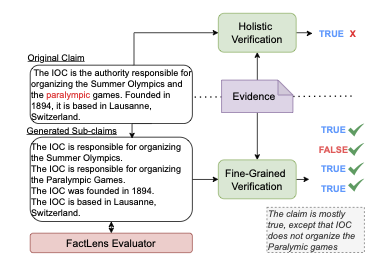

# **FactLens**

> FactLens: Benchmarking Fine-Grained Fact Verification <br/>
> <small>Kushan Mitra, Dan Zhang, Sajjadur Rahman, Estevam Hruschka</small>


Large Language Models (LLMs) have shown impressive capability in language generation and understanding, but their tendency to hallucinate and produce factually incorrect information remains a key limitation. To verify LLM-generated contents and claims from other sources, traditional verification approaches often rely on holistic models that assign a single factuality label to complex claims, potentially obscuring nuanced errors. In this paper, we advocate for a shift towards fine-grained verification, where complex claims are broken down into smaller sub-claims for individual verification, allowing for more precise identification of inaccuracies, improved transparency, and reduced ambiguity in evidence retrieval. However, generating sub-claims poses challenges, such as maintaining context and ensuring semantic equivalence with respect to the original claim.

We introduce FactLens, a benchmark for evaluating fine-grained fact verification, with metrics and automated evaluators of sub-claim quality. The benchmark data is manually curated to ensure high-quality ground truth. Our results show alignment between automated FactLens evaluators and human judgments, and we discuss the impact of sub-claim characteristics on the  overall verification performance.



## Set up environment

```
$ conda create -n ENV_NAME python=3.8
$ conda activate ENV_NAME
```

Set PYTHONPATH
```
$ export PYTHONPATH=$(pwd)
```

Set environment variables `OPENAI_API_KEY` to your OpenAI API key and an optional `OPENAI_ORGANIZATION`

```
echo "export OPENAI_API_KEY=<your_key>" >> ~/.zshrc
echo "export OPENAI_ORGANIZATION=<org_key>" >> ~/.zshrc
```

## Install Requirements

```
$ pip install -r requirements.txt
```

## Load Dataset

We use the [Coverbench](https://huggingface.co/datasets/google/coverbench) dataset, as it compiles complex claims from various domains such as Wikipedia, Legal, Finance, and BioMedical. Claims from diverse sources of data helps us make fine-grained verification more generalizable. 

Run
```
$ python data/load_dataset.py
```

## Fine Grained Verification

To perform Fine-Grained Verification:

1. Generate Sub-Claims:

Run
```
$ python src/sub_claim_generator.py
```

2. Evaluate Sub-Claims:
-  Using LLM-based evaluators

```
$ python src/sub_claim_evaluator.py
```

- Using Automated evaluators
```
$ python src/automated_evaluator.py
```

3. Verification:

To perform verification of a claim/sub-claim given the evidence/context, we provide the `src/verifier.py` file as a starting point. We encourage the usage of building one's own fact-verification methodology, utilizing our benchmark.

Ensure to set `MODEL_NAME` in `src/config.py`. 


## Synthetic Data: Evaluate Sub-Claim Generator

Our synthetically curated data can be found under `synthetic/` folder. This dataset is manually created to perturb ground truth sub-claims to ensure varying quality. This will allow comparison of sub-claim generator models and also to assess them holistically on the task. 

We use 10 claims from the [FEVEROUS](https://fever.ai/dataset/feverous.html) benchmark, and generate one ground-truth sub-claim and 6 more perturbed sub-claims, to give us 70 samples in this dataset. 

The fields in the dataset are
- **claim**: original claim
- **sub_claims**: decomposed sub-claims
- **<metric\>_human1**: evaluation score by human 1 on <metric\>
- **<metric\>_human2**: evaluation score by human 2 on <metric\>

We report the evaluation scores of 2 human annotators on the following metrics: _atomicity_, _sufficiency_, _fabrication_, _coverage_, _redundancy_.


## FactLens Benchmark:

We propose the FactLens benchmark under `benchmark/` folder which enriches existing fact-verification benchmarks with sub-claims and fine-grained verification labels. 

The fields in the dataset are:
- **ind**: Index from CoverBench dataset
- **claim**: Original Claim
- **sub_claims**: Decomposed Sub-Claims
- **labels**: List of verification labels for each sub-claim in the instance
- **aggregated_label**: Claim-level verification label

## Disclosures:

This software may include, incorporate, or access open source software (OSS) components, datasets and other third party components, including those identified below. The license terms respectively governing the datasets and third-party components continue to govern those portions, and you agree to those license terms may limit any distribution, use, and copying. 

You may use any OSS components under the terms of their respective licenses, which may include BSD 3, Apache 2.0, and other licenses. In the event of conflicts between Megagon Labs, Inc. (“Megagon”) license conditions and the OSS license conditions, the applicable OSS conditions governing the corresponding OSS components shall prevail. 

You agree not to, and are not permitted to, distribute actual datasets used with the OSS components listed below. You agree and are limited to distribute only links to datasets from known sources by listing them in the datasets overview table below. You agree that any right to modify datasets originating from parties other than Megagon are governed by the respective third party’s license conditions. 

You agree that Megagon grants no license as to any of its intellectual property and patent rights.  THIS SOFTWARE IS PROVIDED BY THE COPYRIGHT HOLDERS AND CONTRIBUTORS (INCLUDING MEGAGON) “AS IS” AND ANY EXPRESS OR IMPLIED WARRANTIES, INCLUDING, BUT NOT LIMITED TO, THE IMPLIED WARRANTIES OF MERCHANTABILITY AND FITNESS FOR A PARTICULAR PURPOSE ARE DISCLAIMED. IN NO EVENT SHALL THE COPYRIGHT HOLDER OR CONTRIBUTORS BE LIABLE FOR ANY DIRECT, INDIRECT, INCIDENTAL, SPECIAL, EXEMPLARY, OR CONSEQUENTIAL DAMAGES (INCLUDING, BUT NOT LIMITED TO, PROCUREMENT OF SUBSTITUTE GOODS OR SERVICES; LOSS OF USE, DATA, OR PROFITS; OR BUSINESS INTERRUPTION) HOWEVER CAUSED AND ON ANY THEORY OF LIABILITY, WHETHER IN CONTRACT, STRICT LIABILITY, OR TORT (INCLUDING NEGLIGENCE OR OTHERWISE) ARISING IN ANY WAY OUT OF THE USE OF THIS SOFTWARE, EVEN IF ADVISED OF THE POSSIBILITY OF SUCH DAMAGE. You agree to cease using, incorporating, and distributing any part of the provided materials if you do not agree with the terms or the lack of any warranty herein.

While Megagon makes commercially reasonable efforts to ensure that citations in this document are complete and accurate, errors may occur. If you see any error or omission, please help us improve this document by sending information to contact_oss@megagon.ai.

### Datasets

All datasets used within the product are listed below (including their copyright holders and the license information).

For Datasets having different portions released under different licenses, please refer to the included source link specified for each of the respective datasets for identifications of dataset files released under the identified licenses.

</br>


| ID  | OSS Component Name | Modified | Copyright Holder | Upstream Link | License  |
|-----|----------------------------------|----------|------------------|-----------------------------------------------------------------------------------------------------------|--------------------|
| 1 | CoverBench | Yes | Google | [link](https://huggingface.co/datasets/google/coverbench) | Creative Commons Attribution No Derivatives 4.0 |
| 2 | FEVEROUS | Yes | Rami Aly et al. | [link](https://fever.ai/dataset/feverous.html) | Wikipedia Licenses, Creative Commons Attribution-ShareAlike License (version 3.0) |

## Citation 

If you would like to cite our work, the bibtex is:
```
@article{Mitra2024FactLensBF,
  title={FactLens: Benchmarking Fine-Grained Fact Verification},
  author={Kushan Mitra and Dan Zhang and Sajjadur Rahman and Estevam R. Hruschka},
  journal={ArXiv preprint arXiv:2411.05980},
  year={2024},
}
```